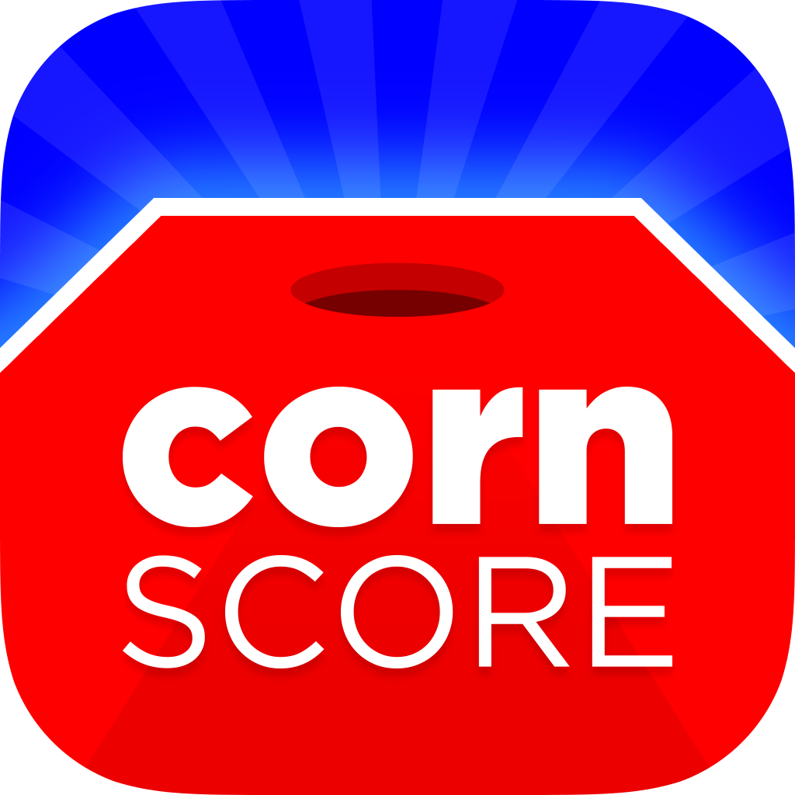

# Scriptit Core

Scriptit Core is a mobile framework for creating iOS apps quick with just plain vanilla javascript. FYI this framework is currently a work in progress. More to come!

## 🗂️ Change Log 

| Release | Date | Notes |
|----------|----------|----------|
| v1.0  | 6/22/25  | - Initial release. |
| v1.1  | 6/29/25  | - Small bug fixes. |
| v1.2  | 7/5/25   | - Added basic phaser support in #28.   - Added confetti module in #27.   - Added validator module in #26.   - Small enhancements to Page component and device module.   - Bug fixes. |

## 🔨 Apps Made With Scriptit Core

## 💰 Support

If you enjoy Scriptit Core, and you feel like this repository is a great learning space for building apps, then feel free to help support further development by keeping me fueled with coffee. Thanks!

## 🧑🏻‍💻 Contributing

At this time Scriptit Core is not open to other code contributions. This may change in the future, but for now this repository is for showcase / learning purposes only.

## 😎 License
Copyright (c) 2023 Colton Boyd

Permission is hereby granted, free of charge, to any person obtaining a copy of this software and associated documentation files (the "Software"), to deal in the Software without restriction, including without limitation the rights to use, copy, modify, merge, publish, distribute, sublicense, and/or sell copies of the Software, and to permit persons to whom the Software is furnished to do so, subject to the following conditions:

The above copyright notice and this permission notice shall be included in all copies or substantial portions of the Software.

THE SOFTWARE IS PROVIDED "AS IS", WITHOUT WARRANTY OF ANY KIND, EXPRESS OR IMPLIED, INCLUDING BUT NOT LIMITED TO THE WARRANTIES OF MERCHANTABILITY, FITNESS FOR A PARTICULAR PURPOSE AND NONINFRINGEMENT. IN NO EVENT SHALL THE AUTHORS OR COPYRIGHT HOLDERS BE LIABLE FOR ANY CLAIM, DAMAGES OR OTHER LIABILITY, WHETHER IN AN ACTION OF CONTRACT, TORT OR OTHERWISE, ARISING FROM, OUT OF OR IN CONNECTION WITH THE SOFTWARE OR THE USE OR OTHER DEALINGS IN THE SOFTWARE.